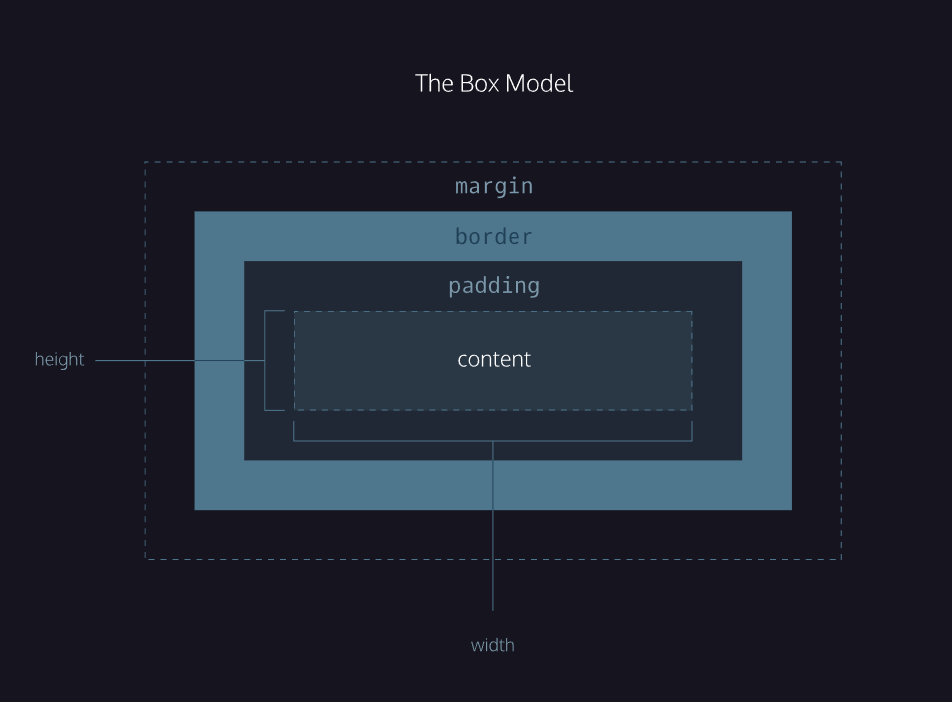

# The Box Model

The box model comprises the set of properties that define parts of an element that take up space on a web page. The model includes the content area’s size (width and height) and the element’s padding, border, and margin. The properties include:

- `width and height`: The width and height of the content area.
- `padding`: The amount of space between the content area and the border.
- `border`: The thickness and style of the border surrounding the content area and padding.
- `margin`: The amount of space between the border and the outside edge of the element.



Fig: Box Model

## 1.Height and Width

An element’s content has two dimensions: a height and a width. By default, the dimensions of an HTML box are set to hold the raw contents of the box.

The CSS height and width properties can be used to modify these default dimensions.

```css
p {
  height: 80px;
  width: 240px;
}
```

In this example, the `height` and `width` of paragraph elements are set to 80 pixels and 240 pixels, respectively — the `px` in the code above stands for pixels.

Pixels allow you to set the exact size of an element’s box (width and height). When the width and height of an element are set in pixels, it will be the same size on all devices — an element that fills a laptop screen will overflow a mobile screen.

## 2. Borders

A border is a line that surrounds an element, like a frame around a painting. Borders can be set with a specific `width`, `style`, and `color`:

`width` —The thickness of the border. A border’s thickness can be set in pixels or with one of the following keywords: `thin`, `medium`, or `thick`.
`style` —The design of the border. Web browsers can render any of 10 different styles. Some of these styles include: `none`, `dotted`, and `solid`.
col`or —The color of the border. Web browsers can render colors using a few different formats, including 140 built-in color keywords.

```css
p {
  border: 3px solid coral;
}
```

In the example above, the border has a width of 3 pixels, a style of `solid`, and a `color` of coral. All three properties are set in one line of code.

The default border is `medium none color`, where color is the current `color` of the element. If `width`, `style`, or `color` are not set in the CSS file, the web browser assigns the default value for that property.

```css
p.content-header {
  height: 80px;
  width: 240px;
  border: solid coral;
}
```

In this example, the border style is set to `solid` and the `color` is set to coral. The width is not set, so it defaults to `medium`.

### A. Border Radius

Ever since we revealed the borders of boxes, you may have noticed that the borders highlight the true shape of an element’s box: square. Thanks to CSS, a border doesn’t have to be square.

You can modify the corners of an element’s border box with the `border-radius` property.

```css
div.container {
  border: 3px solid blue;
  border-radius: 5px;
}
```

The code in the example above will set all four corners of the border to a radius of 5 pixels (i.e. the same curvature that a circle with a radius of 5 pixels would have).

You can create a border that is a perfect circle by first creating an element with the same width and height, and then setting the radius equal to half the width of the box, which is 50%.

```css
div.container {
  height: 60px;
  width: 60px;
  border: 3px solid blue;
  border-radius: 50%;
}
```

The code in the example above creates a `<div>` that is a perfect circle.

## 3. Padding

The space between the contents of a box and the borders of a box is known as padding. `Padding` is like the space between a picture and the frame surrounding it. In CSS, you can modify this space with the `padding` property.

```css
p.content-header {
  border: 3px solid coral;
  padding: 10px;
}
```

The code in this example puts 10 pixels of space between the content of the paragraph (the text) and the borders, on all four sides.

The `padding` property is often used to expand the background color and make the content look less cramped.

If you want to be more specific about the amount of padding on each side of a box’s content, you can use the following properties:

- `padding-top`
- `padding-right`
- `padding-bottom`
- `padding-left`

Each property affects the padding on only one side of the box’s content, giving you more flexibility in customization.

```css
p.content-header {
  border: 3px solid fuchsia;
  padding-bottom: 10px;
}
```

In the example above, only the bottom side of the paragraph’s content will have a `padding` of 10 pixels.
